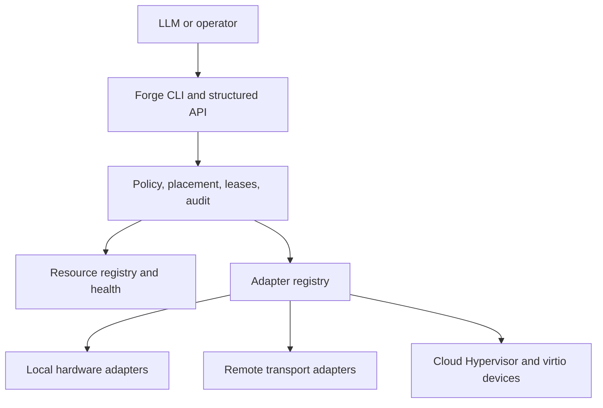

# Project Architecture

Nauti Virtualizer presents a resource-oriented fabric, not a false single-SMP abstraction.

`nauti-fabric` currently implements the portable resource model, local inventory, placement predicates, exclusive leases, adapter authorization, and rust-vmm guest-memory allocation. The control plane stays topology and failure aware; it does not hide remote latency or availability behind an unsafe shared-memory illusion.